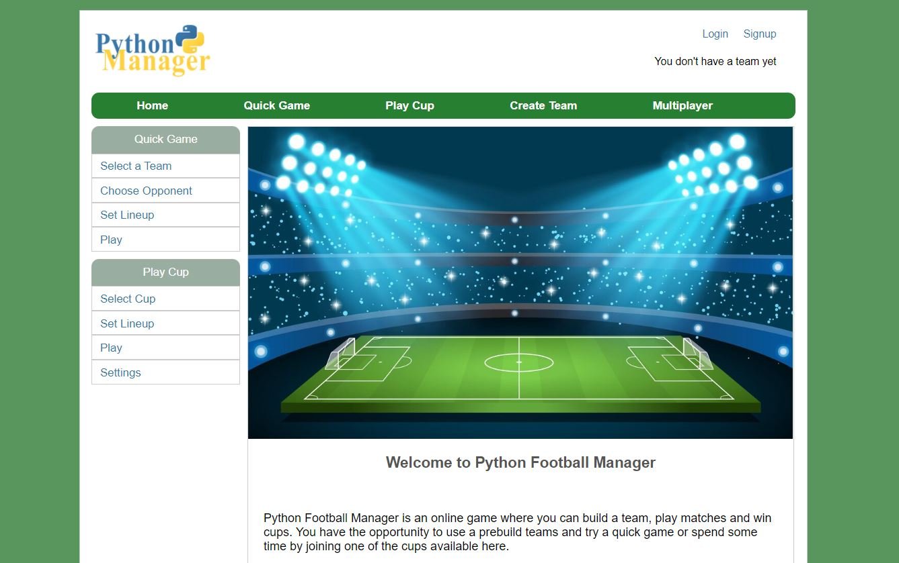

# Python Footlball Manager

PM (Python Manager) is a Python & Flask based online football game.

## Features
You can select a team and play matches in a single or multiplayer mode.
There are a couple of different game options - to play a quick game, participate in a tournament or play agains a friend.

## Installation

Download this repository and start the file /Python-Football-Manager/main.py
This will start a local server on port 5000 with the game.

